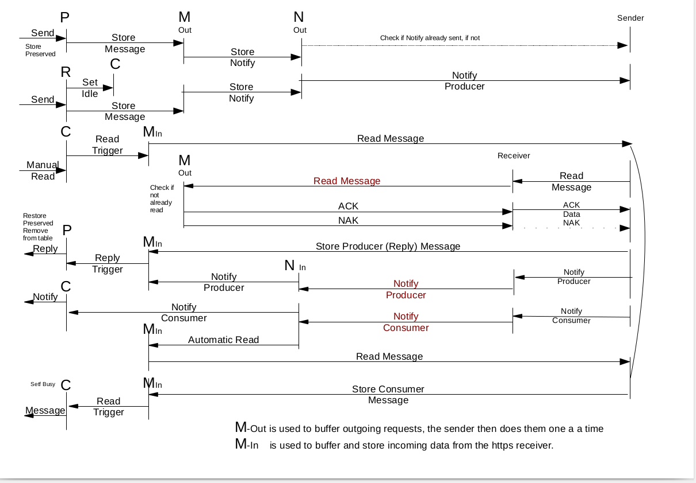

## Redlink V3

### NOTE : Redlink is now version 3, it is incompatable with the version 2 code set . 
### Please update all instances of redlink to V3 before using it, otherwise it will NOT work due to:
#### . Major Producer Notification changes
#### . The Addition of a Consumer Confirmation messages being sent to the consumer - prior to consumer notifies being sent out.
#### . Payloads are now sent from the producer to the consumer using streams.

- [What is Redlink](#what-is-redlink)
- [How does Redlink work](#how-does-redlink-work)
- [Major benefits that this approach provides](#major-benefits-that-this-approach-provides)
- [Why the decision to use AlaSQL as its internal DB](#why-the-decision-to-use-alasql-as-its-internal-db)
- [Why Redlink uses peer to peer for Notifications](#why-redlink-uses-peer-to-peer-for-notifications)
- [Redlinks design stengths are](#redlinks-design-stengths-are)
- [Why not simply use a message broker system](#why-not-simply-use-a-message-broker-system)
- [Why is Redlink Consumer based messaging](#why-is-redlink-consumer-based-messaging)
- [How Redlink actually communicates with other Redlink Instances](#how-redlink-actually-communicates-with-other-redlink-instances)
- [Redlink has two modes of Read and Reply message retrieval](#Redlink-has-two-modes-of-Read-and-Reply-message-retrieval)
- [Redlink has an Interstore Load Balancer](#Redlink-has-an-Interstore-Load-Balancer)
- [Redlink can now control north bound peer connections to allow or disallow redistribution of services](#Redlink-can-now-control-north-bound-peer-connections-to-allow-or-disallow-redistribution-of-services)
- [Tree Hierachy](#tree-hierachy)
- [Producer Consumer to Sender Receiver Socket design](#producer-consumer-to-sender-receiver-socket-design)
- [Redlink Using 3 Transit Nodes where each Transit node requires Service Isolation](#Redlink-Using-3-Transit-Nodes-where-each-Transit-node-requires-Service-Isolation)

## What is Redlink

Redlink is a way of connecting many instances of Node-Red together using soft "service" connections to essentially create a cluster of "service" capability using disparate hardware to create a large grid Node-Red compute network.

## How does Redlink work

Redlink does not use a traditional messaging system, it actually creates a hierarchical mesh of interconnected web services 
using HTTPS-POST as its transport and an OSPF like routing concept.
It works as expected behind a proxy, note that NO_PROXY must not have a "." or wildcard infront of a url. eg, export no_proxy="abc.mydomain.com", this will wildcard anything in fron of the abc.

## Major benefits that this approach provides

It allows a "Consumer" pull method of communication instead of a pub/sub push method for its transport system.

It allows each consumer to consume messages purely on their ability to process them and not have the producers force high workloads on consumers.

It allows scale out using container instances to instantiate many consumers dynamically as the load increases and is very compatible with Kubenetes and ISTIO workloads.

Producers do not have to know or care how message routing is provided, they simply have to have a link (or number of links) to another parent / peer that can route for them.
Only one link direction is required for a neighbour relationsip as on connection, the north bound interface register the south bound connection.

Producers and Consumers are provided with a number of timers on each message to allow them:

	1/ To handle Consumers not processing the work
	2/ Alternate services to work around busy consumers
	3/ Expected End-To-End Transaction times (ETT), allows producers to have an expectation of completeion.
	4/ Priority message processing.
	5/ Messages pointers are stored in AlaSQL with the payload either stored in ram or on disk.
	6/ Messages are not sent to the consumer.
	7/ The producer mearly notifies the consumers and the consumers retreive the messages directly.
	8/ Both the Producer and Consumer can either have manual or automatic read of messages upon being notified.
	9/ Consumers can have in transit limits where many messages can be processed at once without have to wait.
	10/ All message stores can provide transaction queries and mesh registrations by simple questions.

## Why the decision to use AlaSQL as its internal DB

AlaSQL provides a very robust and high level of complexity using very simple SELECT statements and it reduces the code 
required to perform queueing and timing, it also allows DB insert "Triggers" to decouple transaction processing in the stores.

## Why Redlink uses peer to peer for Notifications

The reason for this, is that multiple peer and consumer combinations have actually nothing to do with the production of messaging. What this means is that since Redlink is not a Publish-Subscribe system, more over it is a publish to a single consumer at a time model, this allows fan out micro services to consume messages based on their ability to consume. 
So, lets assume that I have 2 consumers on a service and both are busy, one will fetch the message when it is free and the other will get rejected as the first consumer has already consumed it from the producer.

## Redlinks design stengths are
When a "Service" is local and advertised on this node it will not send notifies to its subordinate children.
When consumers register on nodes, the node automatically registers / deregisters its Services to their peer / parent. 

## Why not simply use a message broker system 

More complexity, this type of system removes one of full layer of having to provide a separate messaging system and has a modern approach to web service architecture, with the best part being parallel computing.

## Why is Redlink Consumer based messaging

As stated, the real issue of scale-out containerisation is that adding compute by using consumer based load distribution 
works well with ISTIO / Kubenetes / Docker / LXC.
Consumer based messaging is infinitly more secure as it is up to the consumer to actually transact the produces request 
based on merit and not a producer simply sending a message.

## How Redlink actually communicates with other Redlink Instances

Each time a connection is established between redlink store nodes, only the notify request data is passed through the inter store mesh, the consumer actually retreives the message directly and the connection is closed, this provides a perfect way of using the least number of sockets with the maximum number of session / connections.

## Redlink has two modes of Read and Reply message retrieval

Redlink as of Version 1.4.1 now defaults to sending read and reply messages by the same path that the notify has traversed. 
The reason that this has been implemented, is to cover messaging across networks and the internet where a single port at both ends can be opened and by providing the stores with an assigned certificate.
This effectively secures the connection as all connections are HTTPS. 
However the user can uncheck the flag or send a message with msg.enforceReturnPath = false (overrides the config checkbox on a per message basis).
This will make the consumer read and reply directly to the producer without traversing any extra stores that may have been in the notify path. 
Please check the "Producer Notification" message and look at the JSON "path" it will display the complete path that the notifcation message took to get to the consumer   

## Redlink has an Interstore Load Balancer

Redlink Stores as of Version 2.2.0
        1. Removed random code as it wasnt really random and it tended to bias the seed values at the ends.
        2. Added two new parameters called ECM (Expected consumer read metric), ERM (Expected consumer reply metric), both values are calculated in milliseconds.
        3. Algorythm uses ECM to workout when a consumer has read the message from the first time it was notified and then informs the stores in reverse order the value all the way back to the producer store
        4. Algorythm uses ERM to workout when a consumer has replied to the message from the time it was notified and then informs the stores in reverse order the value all the way back to the producer store
        5. Loadbalancers can then decide when to send a message to either:
                a. A consumer that is free.
                b. A consumer has a low reply time.
When set in the store - it splits traffic to different target consumer stores.
The the load balancer will detect multiple service registrations of the same name, it will then cause the store to send single producer message notifications using ECM and ERM values to load balance to North / South destination consumer stores.
This feature provides a more equitable consumption of producer messages and a reduction of notifications will be noticed at the consumers and overall in the mesh. It has been turned off by default.

## Redlink can now control north bound peer connections to allow or disallow redistribution of services

Redlink Stores as of Version 2.0.0 introduce the ability to control the redistribution of services from north connected stores, the services are then only visible from the south store and will not be distributed
north or south.
This means that if redistribution is set to false on a north connection and the north peer sends a service to the south store, then only that south store will have visibility. 
The reason this capability was added, was to introduce a service based architecture model where all of the north stores can provide there own unique services and not have south stores providing a relaying conduit.
 
## Tree Hierachy

One of the greatest strengths of Redlink, is that a full redundant mesh can be designed and tested on either a single Node-Red instance or cluster of instances.
The protocol used to achieve this is similar to OSPF.

## Producer Consumer to Sender Receiver Socket design

## Redlink Using 3 Transit Nodes where each Transit node requires Service Isolation

